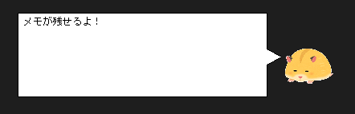

# DesctopMemo
昔作ったメモ用取りようのアプリをCSharp化したもの

- 開発環境  
  Visual Studio 2019  
  Windows10 で動作確認

- こんな感じです  
  ※背景の黒色は私のデスクトップの背景色です  

## ファイル構成
直接ファイルを操作することが無いものは省略  
<pre>
src
├── DesctopMemo
│   ├── CAppSetting.cs      アプリケーションの設定関係の処理
│   ├── Charactor.png       キャラクタの画像(「いらすとや」さんから拝借)
│   ├── DesctopMemo.cs      アプリケーションのメインとなるForm
│   └── Form_Edit.cs        メモを編集するためのForm
└── DesctopMemo.sln         Visual Studioのソリューション
</pre>

## 使い方

- DesctopMemo.exeを起動  
  ※起動直後のアプリケーションの表示位置は固定

- アプリケーションをドラッグすることで移動できる

- 起動しているアプリケーション or タスクトレイのアイコンを右クリックするとメニュー表示

|メニュー項目|内容|
|-|-|
|Edit|メモ書きを編集するためのウインドウが開く ※ウインドウを閉じると変更したメモ書きが反映される|
|About|アプリケーションの情報を表示する|
|Quit|あぷrケーションを終了する|
